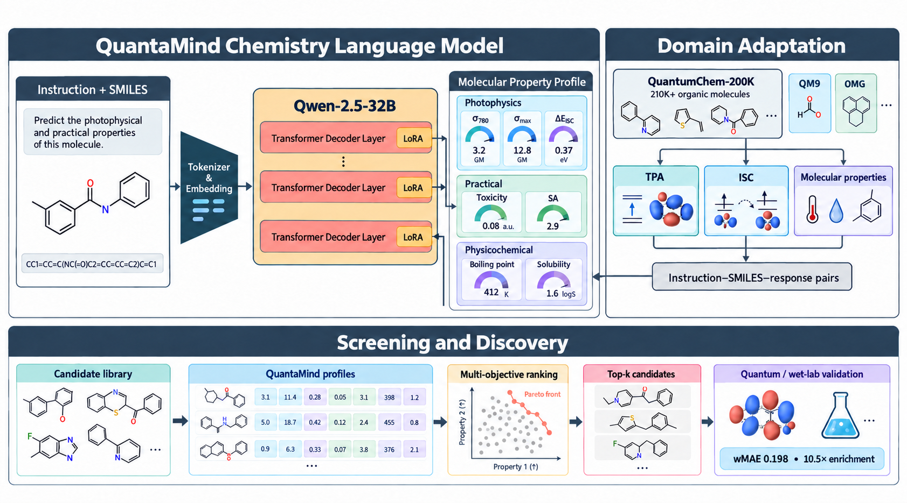
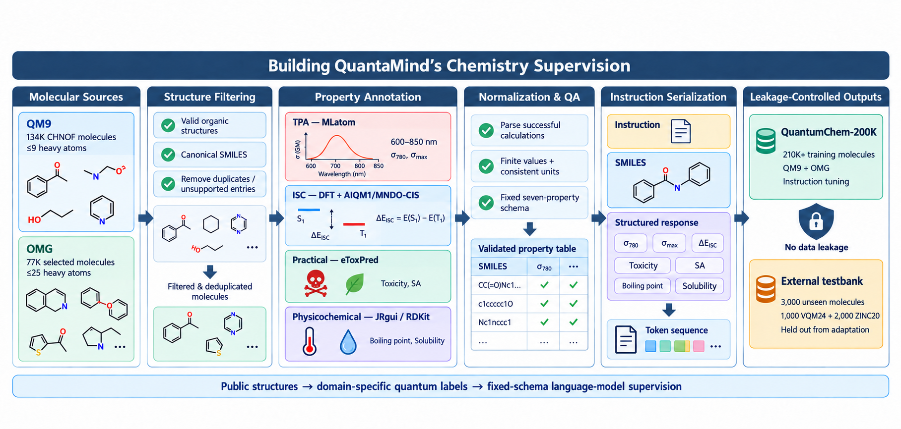
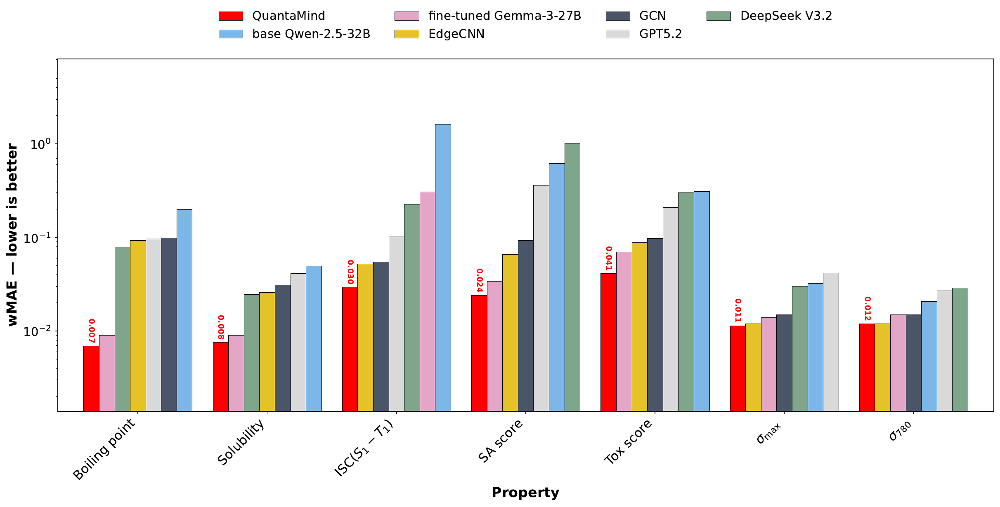
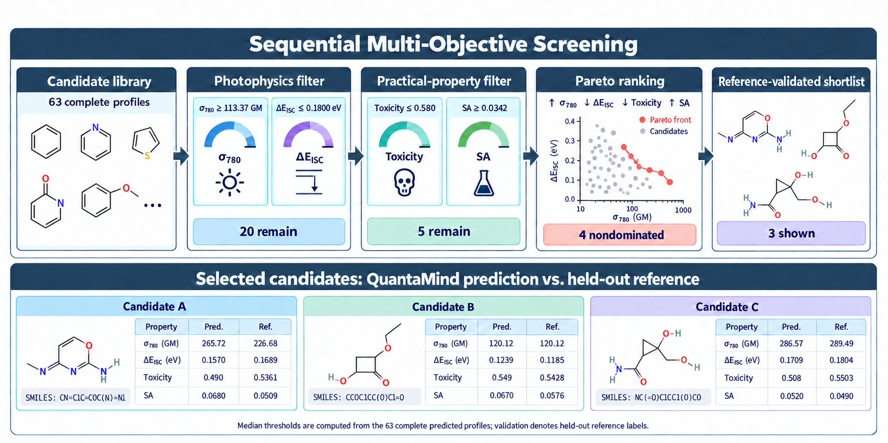

# QUANTAMIND: A LARGE CHEMISTRY LANGUAGE MODEL FOR STRUCTURED MOLECULAR SCREENING AND DISCOVERY

QuantaMind is a 32-billion-parameter chemistry language model for structured molecular-property prediction and multi-objective organic molecular screening. It maps a chemistry instruction and a SMILES string to a parseable molecular-property profile. The model is obtained by parameter-efficient instruction tuning of Qwen-2.5-32B on QuantumChem-200K, a supervision corpus containing more than 214,000 organic molecules with photophysical, quantum-chemical, safety, accessibility, and physicochemical annotations.

The work is currently under review at ICLR 2027. QuantaMind is intended as a high-throughput prioritization layer for molecular screening, with photoinitiator discovery as a demanding case study. Shortlisted candidates still require independent quantum-chemical and experimental validation.

**Resources:** [QuantaMind model](https://huggingface.co/QuantumChem/QuantaMind) | [training corpus](https://huggingface.co/datasets/QuantumChem/QuantumChem-200k-new) | [3,000-molecule testbank](https://huggingface.co/datasets/QuantumChem/QuantumChem_Testbank_3000) | [project website](https://ravenllm.com/)



## Highlights

| Item | Value |
|---|---|
| Backbone | Qwen-2.5-32B decoder-only language model |
| Adaptation | LoRA adapters with a quantized backbone |
| Supervision | More than 210K instruction-SMILES-response examples |
| Primary benchmark | Seven molecular screening properties |
| External evaluation | 3,000 unseen molecules from VQM24 and ZINC20 |
| Overall wMAE | **0.1980** (base Qwen-2.5-32B: 3.3040) |
| Top-100 recovery | **35 / 100** ground-truth candidates |
| Enrichment@100 | **10.50x** |
| Normalized hypervolume regret@20 | **3.26%** |
| Selected schedule | Six epochs; learning rate 2 x 10<sup>-4</sup> |
| Training compute | Four A100 80 GB GPUs; approximately 4-5 days |

## Model task

Given an instruction `q` and a molecular SMILES string `x`, QuantaMind generates an ordered, fixed-schema response containing a molecular-property profile. The primary benchmark evaluates seven nontrivial targets:

| Group | Property | Unit / interpretation | Screening direction |
|---|---|---|---|
| Photophysical | TPA cross section at 780 nm, `sigma_780` | GM | Higher |
| Photophysical | Maximum TPA cross section, `sigma_max` | GM | Higher |
| Excited state | Singlet-triplet ISC energy gap | eV | Lower |
| Practical | Toxicity score | Surrogate score | Lower |
| Practical | Synthetic accessibility score | Surrogate score | Higher |
| Physicochemical | Boiling point | Degrees Celsius | Objective-dependent |
| Physicochemical | Solubility | Dataset-reported scale | Objective-dependent |

Molecular weight, aromaticity, and logP are retained in the training response schema and auxiliary analyses but are excluded from the primary seven-property benchmark because they are comparatively direct to infer from SMILES.

Example input:

```text
Instruction: Predict the photophysical and practical properties of this molecule.
SMILES: C=C(C)OC
```

The generated response follows a fixed property order with explicit units so that the same field-wise parser can be used for regression metrics and downstream candidate ranking.

## Chemistry supervision

QuantumChem-200K uses QM9 and the Open Macromolecular Genome as molecular-structure pools. After validity checks, canonicalization, deduplication, and compatibility filtering, the structures are annotated through a hybrid workflow:

- Two-photon absorption: MLatom-based spectral calculations over 600-850 nm.
- Intersystem crossing: DFT and AIQM1/MNDO-CIS calculations.
- Toxicity and synthetic accessibility: eToxPred-derived scores.
- Boiling point and solubility: JRgui/RDKit-centered property workflows.
- Quality control: successful parsing, finite values, consistent units, fixed schemas, and train-test separation.

The external testbank contains 1,000 VQM24 and 2,000 ZINC20 molecules and is held out from model adaptation.



## Evaluation

Every language model receives the same fixed-schema prompt and numerical parser. API-only systems are evaluated zero-shot at temperature 0.2; QuantaMind, the same-protocol Gemma control, the base Qwen backbone, and graph neural networks provide the controlled comparisons.

### Molecular-property prediction

On the 3,000-molecule external testbank, QuantaMind achieves an overall wMAE of **0.1980**. Domain adaptation reduces the Qwen-2.5-32B backbone's wMAE from 3.3040, while Gemma-3-27B improves from 3.1480 to 0.5297 under the same fine-tuning protocol. The best reported GNN comparator, EdgeCNN, reaches 0.5717 overall wMAE.

| Model | Overall wMAE (lower is better) |
|---|---:|
| Base Qwen-2.5-32B | 3.3040 |
| Base Gemma-3-27B | 3.1480 |
| EdgeCNN | 0.5717 |
| Fine-tuned Gemma-3-27B | 0.5297 |
| **QuantaMind** | **0.1980** |

QuantaMind's property-level wMAE is 0.0106 for `sigma_780`, 0.0104 for `sigma_max`, 0.0273 for ISC, 0.0446 for toxicity, 0.0227 for synthetic accessibility, 0.0074 for boiling point, and 0.0057 for solubility.



### Multi-objective screening

The seven-property screening benchmark evaluates top-k recovery, enrichment, epsilon-Pareto precision, and normalized hypervolume regret. QuantaMind recovers 35 of the ground-truth top 100 candidates and substantially improves hypervolume regret relative to the same-protocol Gemma control.

| Model | Precision@100 | Recall@100 | Enrichment@100 | Epsilon-Pareto precision@20 | Normalized HV regret@20 |
|---|---:|---:|---:|---:|---:|
| Fine-tuned Gemma-3-27B | 0.31 | 0.31 | 9.30 | **0.85** | 42.4% |
| **QuantaMind** | **0.35** | **0.35** | **10.50** | 0.80 | **3.26%** |

The figure below illustrates sequential filtering and Pareto ranking on 63 held-out examples with complete predictions. "Reference-validated" means comparison with computational benchmark labels, not wet-lab validation.



## Repository layout

```text
.
|-- fine tune code/
|   `-- fine_tuning.py                  # Qwen-2.5-32B LoRA training
|-- infer and benchmark code/
|   |-- fine-tuned-infer.ipynb          # Fine-tuned model inference
|   |-- gemma_finetuned_infer.py        # Same-protocol Gemma control
|   |-- claude_infer.py                 # Claude zero-shot baseline
|   |-- infer_deepseek_api.py           # DeepSeek zero-shot baseline
|   |-- testing_infer.ipynb             # Additional inference experiments
|   `-- wmae_eval_sqrt.ipynb            # wMAE evaluation
|-- infer and benchmark data/           # Evaluation inputs and predictions
|-- Quantumchemistry_simulation_code/   # Quantum-chemistry workflow examples
|-- figs/                               # README and evaluation figures
|-- requirements.txt
`-- LICENSE
```

## Installation

Python 3.10 or 3.11 and a CUDA-capable NVIDIA GPU are recommended. The 32B backbone is loaded in 4-bit mode, but substantial GPU memory is still required.

```bash
git clone https://github.com/AnonymousUser-3/QuantaMind.git
cd QuantaMind
python3 -m venv .venv
source .venv/bin/activate
python -m pip install --upgrade pip
python -m pip install -r requirements.txt
```

Install the PyTorch build appropriate for the local CUDA runtime if the default wheel is unsuitable.

## Training and inference

The released scripts are research artifacts rather than a turnkey training package. Before running them, configure dataset, checkpoint, adapter, and input/output paths for your environment.

### Train QuantaMind adapters

```bash
python "fine tune code/fine_tuning.py"
```

For a fresh run, remove or replace the script's `resume_from_checkpoint` setting. The ICLR manuscript uses the current [QuantumChem-200K training corpus](https://huggingface.co/datasets/QuantumChem/QuantumChem-200k-new), six training epochs, and a selected learning rate of `2e-4`.

### Run inference

```bash
jupyter lab "infer and benchmark code/fine-tuned-infer.ipynb"
```

Set the adapter identifier to [`QuantumChem/QuantaMind`](https://huggingface.co/QuantumChem/QuantaMind), or to a downloaded local path, and configure the testbank path before batch inference. The model checkpoint is hosted on Hugging Face rather than bundled with this Git repository.

### Evaluate predictions

```bash
jupyter lab "infer and benchmark code/wmae_eval_sqrt.ipynb"
```

Point the notebook to a ground-truth CSV and a prediction CSV with matching molecule rows and property columns.

## Credentials and large artifacts

Use environment variables for external-service credentials. Never commit API keys or access tokens.

```bash
export HF_TOKEN="your_huggingface_token"
export ANTHROPIC_API_KEY="your_anthropic_api_key"
```

Model checkpoints, adapters, logs, generated outputs, and local environment files should remain outside Git history unless intentionally released through an appropriate artifact store.

## Limitations and intended use

- QuantaMind is a screening model, not a replacement for electronic-structure calculations or experiments.
- Predictions inherit the biases and uncertainty of the computed and model-derived supervision labels.
- SMILES does not explicitly encode three-dimensional conformation, solvent, concentration, formulation, irradiation conditions, or competing relaxation pathways.
- Coverage is limited for heavy elements, unfamiliar scaffolds, kinetics, polymerization dynamics, and fabrication outcomes.
- Toxicity and synthetic-accessibility outputs are surrogate screening scores, not safety determinations.
- Pareto sets and scalar rankings depend on the user's objectives and weights.

Use domain-expert oversight, appropriate chemical-safety controls, and independent validation before acting on any shortlist.

## Citation

If you use this repository, QuantumChem-200K, or the QuantaMind evaluation protocol, please cite the ICLR 2027 submission:

```bibtex
@article{quantamind2026,
  title   = {QUANTAMIND: A LARGE CHEMISTRY LANGUAGE MODEL FOR STRUCTURED MOLECULAR SCREENING AND DISCOVERY},
  author  = {Anonymous Authors},
  journal = {Under review at ICLR 2027},
  year    = {2026},
  url     = {https://github.com/AnonymousUser-3/QuantaMind}
}
```

## License

The code in this repository is released under the [MIT License](LICENSE). Dataset reuse is governed by the dataset cards and the licenses or attribution requirements of the underlying source resources.
